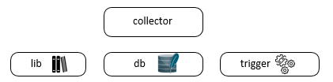

<!DOCTYPE html>
<html>
<head>
</head>
<body>

# collector

  

## General Purpose

The name of the tool describes the functionality as it's best. It collects data!
To do so it uses a bunch full of functions and cmdlets that's been deliverd with the choosen os-collector package. It takes care of an environment to store the collected data. 
In a context like this with different os-collectors, it's mandatory to use a lightweight database structure, therefore it's creating a SQLite Database. The DB table structure can be found underneath
<a href="https://github.com/binbash23/netracker/blob/master/collector/create_collector_database.sql" title="../create_collector_database.sql">../create_collector_database.sql</a>. The seperation of the SQL db structure to a meta-level is due to the fact that all different 'os-collectors' should have access to the same database structure, to avoid future merge trouble shooting. Depending on the configured event trackers, the included trigger starts a que to run each one of them. Every que is unique and has it's own collection of tracking information that will be stored in the collector.db.

# Installation

The Installation depends on the environment you want to use the collector framework. 

The initial project has os collectors for <a href="https://github.com/binbash23/netracker/tree/master/collector/linux" title="linux">linux</a> and <a href="https://github.com/binbash23/netracker/tree/master/collector/win" title="windows">windows</a>, further os-collectors are possible. 

## Contributing

Instructions for contributing to the project go here.

## Credits

Credits for the project go here.

</body>
</html>
