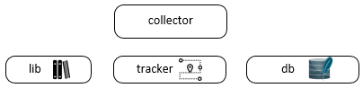

<!DOCTYPE html>
<html>
<head>
</head>
<body>

# collector

  

## General Purpose

The name of the tool describes the functionality as it's best. It collects data!
To do so it uses a bunch full of functions and cmdlets that's been deliverd with the choosen collector package. In a context like this with collectors for different operating systems, it's mandatory to keep an eye on the compatibility. We try to take care for an environment that's independend in it's functionality from the underlaying operating system.

  

Contains the used functions and cmdlets that can be reused during collector and tracker work.

  

The DB table structure can be found underneath
<a href="https://github.com/binbash23/netracker/blob/master/collector/create_collector_database.sql" title="../create_collector_database.sql">../create_collector_database.sql</a>. The seperation of the SQL db structure to a meta-level is due to the fact that all different collectors should have access to the same database structure, to avoid future merge trouble shooting. 

  

Depending on the configured event trackers, the collector starts a que to run each one of them. Every que is unique and has it's own collection of tracking information that will be stored in the collector.db.

# Installation

The Installation depends on the environment you want to use the collector framework. 

The initial project has collectors for <a href="https://github.com/binbash23/netracker/tree/master/collector/linux" title="linux">linux</a> and <a href="https://github.com/binbash23/netracker/tree/master/collector/win" title="windows">windows</a>, further os-collectors are possible. 

## Contributing

Instructions for contributing to the project go here.

## Credits

Credits for the project go here.

</body>
</html>
